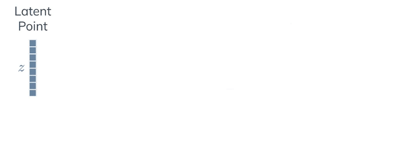
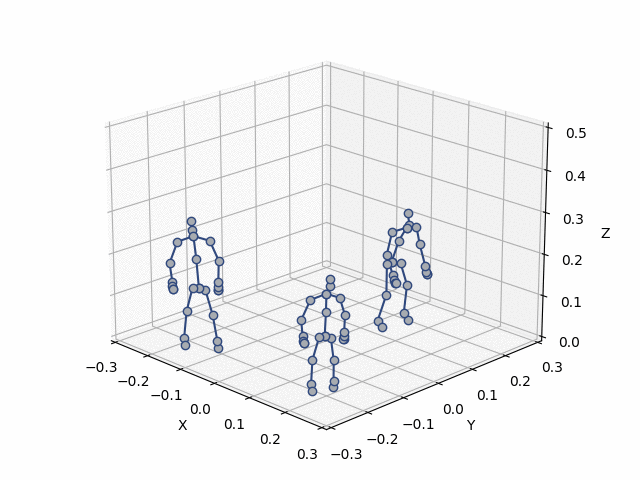

# Kinetic-GAN
This repository contains the official PyTorch implementation of the following paper:
> **Generative Adversarial Graph Convolutional Networks for Human Action Synthesis**, Bruno Degardin, João Neves, Vasco Lopes, João Brito, Ehsan Yaghoubi and Hugo Proença, WACV 2022. [[Arxiv Preprint]](https://arxiv.org/abs/2110.11191)

<div align="center">
  
</div>


## Resources

Material related to our paper is available via the following links:

- Paper: https://arxiv.org/abs/2110.11191
- Video: TBA
- Code: https://github.com/DegardinBruno/Kinetic-GAN
- Datasets (ready to use!):
  - NTU RGB+D: [Download](http://socia-lab.di.ubi.pt/~bruno/kinetic-gan/datasets/NTU/ntu.zip) and uncompress it.
  - NTU-120 RGB+D: [Download](http://socia-lab.di.ubi.pt/~bruno/kinetic-gan/datasets/NTU120/ntu-120.zip) and uncompress it.
  - NTU-2D RGB+D: [Download](http://socia-lab.di.ubi.pt/~bruno/kinetic-gan/datasets/NTU2D/ntu-2d.zip) and uncompress it.
  - Human3.6M: [Download](http://socia-lab.di.ubi.pt/~bruno/kinetic-gan/datasets/H36M/h36m.zip) and uncompress it.


## System requirements and Installation

* Both Linux and Windows are supported, but we strongly recommend Linux for performance and compatibility reasons.
* 64-bit Python 3.7+ installation. We recommend pip.
* PyTorch >= 1.7.1
* GPU is not mandatory, but we highly recommend GPU for results reproducibility and speed.

```bash
pip install -r requirements.txt  # use flag --user if permission needed
```

## Model Zoo and Benchmarks

PyTorchVideo provides reference implementation of a large number of video understanding approaches. In this document, we also provide comprehensive benchmarks to evaluate the supported models on different datasets using standard evaluation setup. All the models can be downloaded from the provided links.

### NTU RGB+D (60 action classes)

arch     | benchmark | actions | frame length x<br /> coordinate dimensions | FID | Config | Model
-------- | --------- | ------- | ------------ | --- | ------ | -----
<strong>kinetic-gan-mlp4</strong> | <strong>cross-subject</strong> | <strong>60</strong> | <strong>64 x 3</strong> | <strong>3.618</strong> | [config](http://socia-lab.di.ubi.pt/~bruno/kinetic-gan/models/NTU/xsub/config_ntu_xsub_mlp4.txt) | [weights](http://socia-lab.di.ubi.pt/~bruno/kinetic-gan/models/NTU/xsub/generator_ntu_xsub_mlp4_1370000.pth)
kinetic-gan-mlp8 | cross-subject | 60 | 64 x 3 | 4.396 | [config](http://socia-lab.di.ubi.pt/~bruno/kinetic-gan/models/NTU/xsub/config_ntu_xsub_mlp8.txt) | [weights](http://socia-lab.di.ubi.pt/~bruno/kinetic-gan/models/NTU/xsub/generator_ntu_xsub_mlp8_1251000.pth)
<strong>kinetic-gan-mlp6</strong> | <strong>cross-view</strong> | <strong>60</strong> | <strong>64 x 3</strong> | <strong>4.235</strong> | [config](http://socia-lab.di.ubi.pt/~bruno/kinetic-gan/models/NTU/xview/config_ntu_xview_mlp6.txt) | [weights](http://socia-lab.di.ubi.pt/~bruno/kinetic-gan/models/NTU/xview/generator_ntu_xview_mlp6_1410000.pth)
kinetic-gan-mlp8 | cross-view | 60 | 64 x 3 | 4.610 | [config](http://socia-lab.di.ubi.pt/~bruno/kinetic-gan/models/NTU/xview/config_ntu_xview_mlp8.txt) | [weights](http://socia-lab.di.ubi.pt/~bruno/kinetic-gan/models/NTU/xview/generator_ntu_xview_mlp8_1390000.pth)

*FID results can differ a bit due to random normal distribution and random noise<br />
** Better action control with MLP-depth 8 (check by yourself with visualization)


### NTU-120 RGB+D (120 action classes)

arch     | benchmark | actions | frame length x<br /> coordinate dimensions | FID | Config | Model
-------- | --------- | ------- | ------------ | --- | ------ | -----
<strong>kinetic-gan-mlp8</strong> | <strong>cross-subject</strong> | <strong>120</strong> | <strong>64 x 3</strong> | <strong>5.967</strong> | [config](http://socia-lab.di.ubi.pt/~bruno/kinetic-gan/models/NTU120/xsub/config_ntu120_xsub_mlp8.txt) | [weights](http://socia-lab.di.ubi.pt/~bruno/kinetic-gan/models/NTU120/xsub/generator_ntu120_xsub_mlp8_2150000.pth)
<strong>kinetic-gan-mlp8</strong> | <strong>cross-setup</strong> | <strong>120</strong> | <strong>64 x 3</strong> | <strong>6.751</strong> | [config](http://socia-lab.di.ubi.pt/~bruno/kinetic-gan/models/NTU120/xsetup/config_ntu120_xsetup_mlp8.txt) | [weights](http://socia-lab.di.ubi.pt/~bruno/kinetic-gan/models/NTU120/xsetup/generator_ntu120_xsetup_mlp8_2275000.pth)

*FID results can differ a bit due to random normal distribution and random noise<br />
** Better action control with MLP-depth 8 (check by yourself with visualization)


### Human3.6M (10 action classes)

arch     | actions | frame length x<br /> coordinate dimensions | MMDa | MMDs | Config | Model
-------- | ------- | ------------ | ---- | ---- | ------ | -----
kinetic-gan-mlp4 | 10 | 32 x 2 | 0.071 | 0.079 | [config](http://socia-lab.di.ubi.pt/~bruno/kinetic-gan/models/H36M/32/config_mlp4_h36m_32.txt) | [weights](http://socia-lab.di.ubi.pt/~bruno/kinetic-gan/models/H36M/32/generator_mlp4_h36m_32_390000.pth)
kinetic-gan-mlp8 | 10 | 64 x 2 | 0.074 | 0.088 | [config](http://socia-lab.di.ubi.pt/~bruno/kinetic-gan/models/H36M/64/config_mlp8_h36m_64.txt) | [weights](http://socia-lab.di.ubi.pt/~bruno/kinetic-gan/models/H36M/64/generator_mlp8_h36m_64_440000.pth)
kinetic-gan-mlp8 | 10 | 128 x 2 | 0.076 | 0.102 | [config](http://socia-lab.di.ubi.pt/~bruno/kinetic-gan/models/H36M/128/config_mlp8_h36m_128.txt) | [weights](http://socia-lab.di.ubi.pt/~bruno/kinetic-gan/models/H36M/128/generator_mlp8_h36m_128_500000.pth)
kinetic-gan-mlp8 | 10 | 256 x 2 | 0.081 | 0.112 | [config](http://socia-lab.di.ubi.pt/~bruno/kinetic-gan/models/H36M/256/config_mlp8_h36m_256.txt) | [weights](http://socia-lab.di.ubi.pt/~bruno/kinetic-gan/models/H36M/256/generator_mlp8_h36m_256_525000.pth)
kinetic-gan-mlp4 | 10 | 512 x 2 | 0.087 | 0.115 | [config](http://socia-lab.di.ubi.pt/~bruno/kinetic-gan/models/H36M/512/config_h36m_512_mlp4.txt) | [weights](http://socia-lab.di.ubi.pt/~bruno/kinetic-gan/models/H36M/512/generator_h36m_512_mlp4_455000.pth)
kinetic-gan-mlp4 | 10 | 1024 x 2 | 0.092 | 0.121 | [config](http://socia-lab.di.ubi.pt/~bruno/kinetic-gan/models/H36M/1024/config_h36m_1024_mlp4.txt) | [weights](http://socia-lab.di.ubi.pt/~bruno/kinetic-gan/models/H36M/1024/generator_h36m_1024_mlp4_650000.pth)

*MMD results can differ a bit due to random normal distribution and random noise<br />
**Additionally, MMD metric is not as "stable" and descriptive as FID, check paper results and visual quality.


## Using pre-trained networks
You can generate your own samples by using a pre-trained Kinetic-GAN with specified [config and weights](https://github.com/DegardinBruno/Kinetic-GAN#model-zoo-and-benchmarks) as folows:

1. Edit or use [generate.py](./generate.py) to specify the dataset where it was trained and arguments.
2. Run the training script with (Check class indexes (label -1) at [NTU RGB+D Datasets](https://rose1.ntu.edu.sg/dataset/actionRecognition/)):
```bash
python generate.py --model model_path  --n_classes number_classes  --label class_index  --gen_qtd how_many_samples  # Check generate.py file
```
3. The experiments (config and samples) are written to a newly created directory `runs/kinetic-gan/exp<id>`.
4. Synthesising is really fast even for huge amounts of samples (GPU recommended but not mandatory).
5. To visualize your samples (`action_ntu.py` for NTU RGB+D and NTU-120 RGB+D and `action_h36m.py` for Human3.6M):
```bash
python visualization/action_ntu.py --path path_samples --labels path_labels --indexes 0 1 2  # Example for Kinetic-GAN trained on NTU or NTU-120
```

## Visualization
You can visualize your samples (`action_ntu.py` for NTU RGB+D and NTU-120 RGB+D and `action_h36m.py` for Human3.6M) by specifying the synthetic samples and labels as follows:
```bash
python visualization/action_ntu.py --path path_samples --labels path_labels --indexes 0 1 2  # Example for Kinetic-GAN trained on NTU or NTU-120, check action_ntu.py file
```

Training will save 10 samples per class at each specified iteration interval. For training with NTU RGB+D, classes are repeated at every 60 samples, run:
```bash
python visualization/action_ntu.py --path path_samples --indexes 26 86 146   # ... Example for `jump up` action.
python visualization/action_ntu.py --path path_samples --indexes 23 83 143   # ... Example for `kicking something` action.
python visualization/action_ntu.py --path path_samples --indexes 58 118 178  # ... Example for `walking` action.
```

<div align="center">
  
</div>


### Blender Visualization
Blender visualization (with mesh) is only applied for a more appealing visualization. For accessing and reproducing our visualization, use specifically our [blender.py](./visualization/blender.py) and [Blender 2.9+ with Python interpreter](https://www.blender.org/download/) (Interpreter already included in Blender) with [blend file](./visualization/file-initial.blend). [IMPORTANT] Armature needs to be at that specific start position (ctrl-z to return), and configure rotation on X-axis for better visualization.

<div align="center">
  
</div>

Kinetic-GAN generates up to 120 different skeleton actions trained on skeleton-based datasets, which do not have bone rotations specified and dependable by their parent bones, and may cause some poor visualizations with a mesh sometimes (check the initial gif at early iterations).


## Training networks
Datasets are ready to use, after downloading from [resources](https://github.com/DegardinBruno/Kinetic-GAN#resources) you can train your own Kinetic-GAN networks as follows:
1. Edit or use [kinetic-gan.py](./kinetic-gan.py) to specify the dataset and training configuration and arguments.
2. Run the training script with:
```bash
python kinetic-gan.py  --data_path path_train_data.npy  --label_path path_train_labels.pkl  --dataset ntu_or_h36m  # check kinetic-gan.py file
```
3. The experiments (files, loss, weights and samples) are written to a newly created directory `runs/kinetic-gan/exp<id>`.
4. For following up the training loss run (it will save image at the `exp<id>` directory):
```bash
python visualization/plot_loss.py --batches num_batches_per_epoch --runs kinetic-gan  # check plot_loss.py file
```
5. Training may take from 24 up to 72 hours to complete (using gpu), depending on the configuration and dataset.


## Quality metrics
Similar to image modelling, evaluation is performed where the generative algorithm was trained to compare both distributions. We strongly recommend using FID metric for further works, which is far more descriptive than MMD (check paper results to see the gap between better and worst configurations w.r.t. both metrics).<br/>
1. generate your samples (synthetic distribution). All experiments were computed by generating 1000 samples per action class on all datasets. Check model's configs to set up your generator:

```bash
python generate.py --model model_path  --n_classes number_classes  --dataset ntu_or_h36m  --gen_qtd 1000  # Check model configs to set up the generator
```
2. Evaluate with FID with generated samples (saved in last `exp<id>` directory), can take up to 10/15 minutes:
```bash
python evaluation/fid-actions.py  path_real_samples  path_real_labels  path_fake_samples  path_fake_labels 
```
3. To evaluate with MMD (avg - MMDa, joint - MMDs) with generated samples (saved in last `exp<id>` directory), do not forget to specify the dataset (check `evaluation/mmd-actions.py` for details). Can take up to 5/10 minutes:
```bash
python evaluation/mmd-actions.py  --mmd_mode avg_or_joint  --data_real real_data  --labels_real real_labels  --data_fake fake_samples  --labels_fake fake_labels 
```

## Citation
Please cite this paper in your publications if it helps your research:

    @article{degardin2021generative,
      title={Generative Adversarial Graph Convolutional Networks for Human Action Synthesis},
      author={Bruno Degardin, Joao Neves, Vasco Lopes, Joao Brito, Ehsan Yaghoubi, Hugo Proenca},
      journal={arXiv preprint arXiv:2110.11191},
      year={2021}
    }