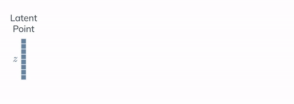

# Kinetic-GAN
This repository contains the official PyTorch implementation of the following paper:
> **Generative Adversarial Graph Convolutional Networks for Human Action Synthesis**, Bruno Degardin, João Neves, Vasco Lopes, João Brito, Ehsan Yaghoubi and Hugo Proença, WACV 2022. [[Arxiv Preprint]](https://arxiv.org/abs/2110.11191)

<div align="center">
  
</div>


## Resources

Material related to our paper is available via the following links:

- Paper: https://arxiv.org/abs/2110.11191
- Video: TBA
- Code: https://github.com/DegardinBruno/Kinetic-GAN
- Datasets
  - NTU RGB+D: http://socia-lab.di.ubi.pt
  - NTU-120 RGB+D: http://socia-lab.di.ubi.pt
  - NTU-2D RGB+D: http://socia-lab.di.ubi.pt
  - Human3.6M: http://socia-lab.di.ubi.pt


## System requirements and Installation

* Both Linux and Windows are supported, but we strongly recommend Linux for performance and compatibility reasons.
* 64-bit Python 3.7+ installation. We recommend pip.
* PyTorch >= 1.7.1
* GPU is not mandatory, but we highly recommend GPU for results reproducibility and speed.

```bash
pip install -r requirements.txt  # use flag --user if permission needed
```

## Model Zoo and Benchmarks

PyTorchVideo provides reference implementation of a large number of video understanding approaches. In this document, we also provide comprehensive benchmarks to evaluate the supported models on different datasets using standard evaluation setup. All the models can be downloaded from the provided links.

### NTU RGB+D

arch     | benchmark | actions | frame length | FID | Config | Model
-------- | --------- | ------- | ------------ | --- | ------ | -----
kinetic-gan-mlp4 | cross-subject | 60 | 64 | 3.618 | [config](http://socia-lab.di.ubi.pt) | [weights](http://socia-lab.di.ubi.pt)
kinetic-gan-mlp6 | cross-view | 60 | 64 | 4.235 | [config](http://socia-lab.di.ubi.pt) | [weights](http://socia-lab.di.ubi.pt)

*FID results can differ a bit due to random normal distribution and random noise
** Better action control with MLP-depth 8 (check by yourself with visualization)


### NTU-120 RGB+D

arch     | benchmark | actions | frame length | FID | Config | Model
-------- | --------- | ------- | ------------ | --- | ------ | -----
kinetic-gan-mlp6 | cross-subject | 120 | 64 | 5.967 | [config](http://socia-lab.di.ubi.pt) | [weights](http://socia-lab.di.ubi.pt)
kinetic-gan-mlp8 | cross-setup | 120 | 64 | 6.751 | [config](http://socia-lab.di.ubi.pt) | [weights](http://socia-lab.di.ubi.pt)

*FID results can differ a bit due to random normal distribution and random noise
** Better action control with MLP-depth 8 (check by yourself with visualization)


### Human3.6M

arch     | actions | frame length | MMDa | MMDs | Config | Model
-------- | ------- | ------------ | ---- | ---- | ------ | -----
kinetic-gan-mlp6 | 120 | 32 | 0.071 | 0.079 | [config](http://socia-lab.di.ubi.pt) | [weights](http://socia-lab.di.ubi.pt)
kinetic-gan-mlp8 | 120 | 64 | 0.074 | 0.088 | [config](http://socia-lab.di.ubi.pt) | [weights](http://socia-lab.di.ubi.pt)
kinetic-gan-mlp8 | 120 | 128 | 0.076 | 0.102 | [config](http://socia-lab.di.ubi.pt) | [weights](http://socia-lab.di.ubi.pt)
kinetic-gan-mlp8 | 120 | 256 | 0.081 | 0.112 | [config](http://socia-lab.di.ubi.pt) | [weights](http://socia-lab.di.ubi.pt)
kinetic-gan-mlp8 | 120 | 512 | 0.087 | 0.115 | [config](http://socia-lab.di.ubi.pt) | [weights](http://socia-lab.di.ubi.pt)
kinetic-gan-mlp8 | 120 | 1024 | 0.092 | 0.121 | [config](http://socia-lab.di.ubi.pt) | [weights](http://socia-lab.di.ubi.pt)

*MMD results can differ a bit due to random normal distribution and random noise<br />
**Additionally, MMD metric is not as "stable" and descriptive as FID, check paper results and visual quality.


## Using pre-trained networks
You can generate your own samples by using a pre-trained Kinetic-GAN with specified [config and weights](https://github.com/DegardinBruno/Kinetic-GAN#model-zoo-and-benchmarks) as folows:

1. Edit or use [generate.py](./generate.py) to specify the dataset where it was trained and arguments.
2. Run the training script with (Check class indexes (-1) at [NTU RGB+D Datasets](http://rose1.ntu.edu.sg/datasets/actionrecognition.asp)):
```bash
python generate.py --model model_path  --n_classes number_classes  --label class_index  --gen_qtd how_many_samples  # Check generate.py file
```
3. The experiments (config and samples) are written to a newly created directory `runs/kinetic-gan/exp<id>`.
4. Synthesising is really fast even for huge amounts of samples (GPU recommended but not mandatory).
5. To visualize your samples (`action_ntu.py` for NTU RGB+D and NTU-120 RGB+D and `action_h36m.py` for Human3.6M):
```bash
python visualization/action_ntu.py --path path_samples --labels path_labels --indexes 0 1 2  # Example for Kinetic-GAN trained on NTU or NTU-120
```


## Training networks
Datasets are ready to use, after downloading from [resources](https://github.com/DegardinBruno/Kinetic-GAN#resources) you can train your own Kinetic-GAN networks as follows:
1. Edit or use [kinetic-gan.py](./kinetic-gan.py) to specify the dataset and training configuration and arguments.
2. Run the training script with:
```bash
python kinetic-gan.py  --data_path path_train_data.npy  --label_path path_train_labels.pkl  --dataset which_dataset  # check kinetic-gan.py file
```
3. The experiments (files, loss, weights and samples) are written to a newly created directory `runs/kinetic-gan/exp<id>`.
4. For following up the training loss run:
```bash
python visualization/plot_loss.py --batches num_batches_per_epoch --runs kinetic-gan  # check plot_loss.py file
```
5. Training may take up to 48 or 72 hours to complete (using gpu), depending on the configuration and dataset.


---

### Visualization
Visualization of synthetic samples. Check [NTU-RGB+D](http://rose1.ntu.edu.sg/datasets/actionrecognition.asp) dataset labels (index=label-1).
Generator synthesizes 10 samples from the 60 classes. Classes are repeated at every 60 samples, check "jump up" example below.

```
python visualization/synthetic.py --path path_samples --index_sample 26 86 146  # Multiple samples indexes (Max 3) 
```

Check current loss.
```
python visualization/plot_loss.py  # Check inside settings
```
